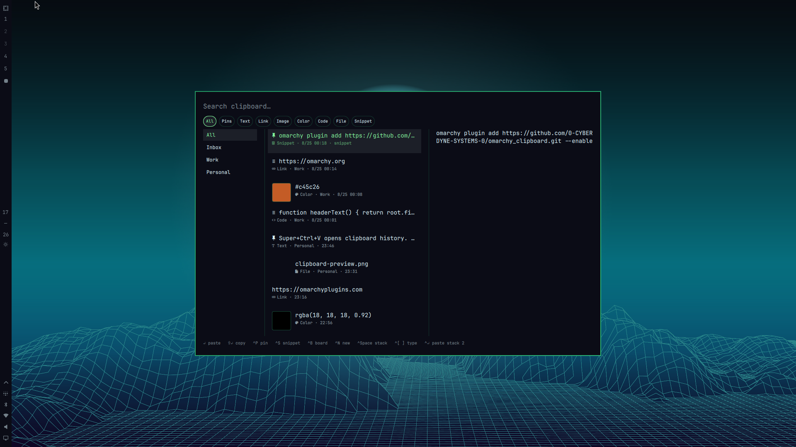

# Clipboard

Searchable clipboard history for [Omarchy](https://omarchy.org) Quattro. Pins, boards, snippets, typed cards, and a stack on top of the stock overlay.

Plugin id: `io.github.0-cyberdyne-systems-0.clipboard`. MIT. Independent community plugin. Not affiliated with Omarchy or 37signals.

No sudo or pkexec. No network calls. No extra packages.

<p align="center"></p>

## Install

```sh
omarchy plugin add https://github.com/0-CYBERDYNE-SYSTEMS-0/omarchy_clipboard.git --enable
```

`omarchy plugin add` only clones files. Enabling the plugin is the consent to load it in `omarchy-shell`. Review the source first. Plugins run unsandboxed.

This replaces the built-in clipboard overlay. **Super+Ctrl+V** and `omarchy menu clipboard` keep working because the manifest sets `clonedFrom` to `omarchy.clipboard`. Removing the plugin restores the stock overlay.

Optional extra hotkey in `~/.config/hypr/bindings.lua`:

```lua
o.bind("SUPER + SHIFT + V", "Clipboard history", "omarchy-shell shell toggle omarchy.clipboard")
```

## Overlay

| Key | Action |
|---|---|
| Type | Search |
| Enter | Insert into the focused window |
| Shift+Enter | Copy only |
| Alt+Enter | Open |
| Ctrl+P | Pin / unpin |
| Ctrl+S | Save / clear snippet |
| Ctrl+B | Assign to current board |
| Ctrl+N | New board |
| Ctrl+Space | Add / remove from stack |
| Ctrl+Enter | Insert the whole stack |
| Ctrl+[ / ] | Cycle type chips |
| Ctrl+Tab | Cycle boards |
| Delete | Remove one clip |
| Shift+Delete | Clear unpinned history (pins and snippets stay) |

Type chips: All, Pins, Text, Link, Image, Color, Code, File, Snippet.

## CLI

The plugin ships `bin/omarchy-clips`. Symlink it onto your PATH if you want:

```sh
ln -s ~/.config/omarchy/plugins/io.github.0-cyberdyne-systems-0.clipboard/bin/omarchy-clips ~/.local/bin/omarchy-clips
```

```sh
omarchy-clips search token
omarchy-clips list --pinned
omarchy-clips pin 1
omarchy-clips snippet <id>
omarchy-clips board 1 Work
omarchy-clips paste 1
omarchy-clips stack add 1
omarchy-clips stack paste
```

Indexes are 1-based from the current list. Ids are stable and better for scripts.

`paste` types into the focused window. `copy` only updates the clipboard.

## Store

- History: `~/.local/state/omarchy/clipboard-history.json`
- Boards / stack: `~/.local/state/omarchy/clipboard-extras.json`
- Images: `~/.local/state/omarchy/clipboard-images/`

Stock helpers still work. Extra fields (`id`, `kind`, `pinned`, `snippet`, `board`, `capturedAt`) are additive. Password-manager hints (`x-kde-passwordManagerHint` / `CLIPBOARD_STATE=sensitive`) are skipped.

## Requirements

- Omarchy Quattro (`omarchy-clipboard-paste-text`, `omarchy-clipboard-paste-file`, `omarchy-clipboard-open`)
- `wl-clipboard` and `jq` (already used by the stock clipboard plugin)
- Optional CLI: Node.js on PATH

## Remove

```sh
omarchy plugin remove io.github.0-cyberdyne-systems-0.clipboard
```

That restores the stock clipboard overlay. History files are left in place.

## License

MIT. Derived from Omarchy’s built-in `omarchy.clipboard` plugin.
